# Seq2SeqLatentGNN

A sequence‑to‑sequence graph forecasting model with a **learnable latent graph** and **Fourier encoding**. The network predicts future values for all nodes in a graph by discovering both static and dynamic correlations end‑to‑end.

> This repo contains: `Seq2SeqLatentGNN`, a latent‐edge GNN + LSTM decoder, a Gaussian smoothing head, and utilities to visualize the learned adjacency.

---

## Highlights

* **Latent graph learning**: `LatentCorrelationGCN` learns an adjacency via attention; optional **top‑k sparsification** and temperature control.
* **Spectral encoder**: `CustomFourierLayer` captures global spatiotemporal patterns with truncated 2D FFT mixing.
* **Seq2Seq temporal modeling**: 2‑layer LSTM encoder/decoder with attention over encoder states.
* **Stability & smoothing**: Gaussian temporal smoother and light 1D conv smoother on outputs.
* **Interpretable**: Access attention matrices to inspect the discovered graph.

---

## Architecture

```mermaid
flowchart LR
  X["Inputs B×T_in×N×F"] -->|permute| FNO["CustomFourierLayer rFFT2"]
  FNO -->|residual add| XT["Encoded tensor B×T_in×N×F"]
  subgraph Latent_Graph_per_t
    XT --> LGCN1["LatentCorrelationGCN in:F→H"]
    LGCN1 --> LGCN2["LatentCorrelationGCN in:H→H"]
  end
  LGCN2 --> ENCSTACK["Stack over time B×T_in×N×H"]
  ENCSTACK -->|reshape B×N×T_in×H| LSTMENC["LSTM Encoder"]
  LSTMENC -->|h,c| LSTMDEC["LSTM Decoder"]
  LSTMDEC --> ATT["Attention over encoder states"]
  ATT --> FC["FC_out + final_out"]
  FC --> OUTSEQ["Predictions B×T_out×N"]
  OUTSEQ --> GAUSS["GaussianSmoothingLayer"]
  GAUSS --> Yhat["Smoothed predictions"]
```



---

## Installation

```bash
# Python >=3.9, PyTorch >=2.1 recommended
pip install torch numpy
```

Optional (for examples/plots): `matplotlib`

---

## Quickstart

```python
import torch
from model import Seq2SeqLatentGNN  # adjust import path

B, T_in, T_out, N, F = 8, 24, 12, 20, 3
x = torch.randn(B, T_in, N, F)

model = Seq2SeqLatentGNN(
    node_input_dim=F,
    hidden_dim=64,
    num_nodes=N,
    out_seq_len=T_out,
    k_neighbors=4,               # None for dense attention
    teacher_forcing_ratio=0.5,
)

with torch.no_grad():
    y_pred, A = model(x, teacher_forcing=False)
print(y_pred.shape)  # [B, T_out, N]
print(A.shape)       # [B, N, N] (last timestep attention)
```

---

## Input/Output Shapes

* Inputs: `node_features` with shape **\[B, T\_in, N, F]**
* Targets (optional for teacher forcing): **\[B, T\_out, N]**
* Outputs: tuple `(pred, attn)` where

  * `pred`: **\[B, T\_out, N]** (smoothed)
  * `attn`: **\[B, N, N]** last latent‑graph attention

---

## Core Modules

### GaussianSmoothingLayer

Lightweight temporal Gaussian filter applied to the decoder output sequence.

### CustomFourierLayer

* 2D rFFT on `[time, nodes]`, truncated by `modes1`, `modes2`.
* Complex weights mix low‑frequency coefficients, then inverse rFFT back to the space‑time grid.

### LatentCorrelationGCN

Learns an adjacency via attention between node embeddings.

* `k_neighbors`: keep top‑k edges per node (sparse); `None` for dense.
* `temperature`: softmax temperature; lower values yield sharper graphs.
* Optionally learns a static correlation matrix added to dynamic scores.

---

## Training Loop Sketch

```python
import torch, torch.nn as nn

model = Seq2SeqLatentGNN(F, 64, N, out_seq_len=T_out, k_neighbors=4)
optimizer = torch.optim.AdamW(model.parameters(), lr=3e-4, weight_decay=1e-4)
criterion = nn.L1Loss()

for epoch in range(50):
    model.train()
    for x, y in train_loader:          # x: [B, T_in, N, F], y: [B, T_out, N]
        y_hat, _ = model(x, targets=y, teacher_forcing=True)
        loss = criterion(y_hat, y)
        optimizer.zero_grad(); loss.backward(); optimizer.step()
```

---

## Evaluation Utilities

```python
import numpy as np

def metrics(y_true, y_pred, eps=1e-8):
    mse = np.mean((y_true - y_pred) ** 2)
    rmse = np.sqrt(mse)
    mae = np.mean(np.abs(y_true - y_pred))
    mape = np.mean(np.abs((y_true - y_pred) / (np.abs(y_true) + eps))) * 100
    return dict(MSE=mse, RMSE=rmse, MAE=mae, MAPE=mape)
```

---

## Visualizing the Learned Graph

```python
import matplotlib.pyplot as plt

def plot_attention(A, title="Latent adjacency"):
    # A: [B, N, N]
    A0 = A[0].detach().cpu().numpy()
    plt.imshow(A0, interpolation="nearest")
    plt.title(title); plt.xlabel("to node"); plt.ylabel("from node")
    plt.colorbar(); plt.tight_layout(); plt.show()
```

---

## Tips & Notes

* PyTorch ≥ 2.0: consider `torch.compile(model)` for speedups.
* Mixed precision: enable `torch.cuda.amp.autocast` + `GradScaler` during training.
* `k_neighbors=None` learns dense graphs; start dense, then prune by setting a smaller `k_neighbors` for efficiency.
* Tune `temperature` to control graph sharpness.
* Teacher forcing: pass `targets` and set `teacher_forcing=True`; ratio controlled by `teacher_forcing_ratio` in the constructor.

---

## Configuration Reference

```python
Seq2SeqLatentGNN(
  node_input_dim: int,         # F
  hidden_dim: int,             # H
  num_nodes: int,              # N
  out_seq_len: int,            # T_out
  k_neighbors: Optional[int] = 4,
  teacher_forcing_ratio: float = 0.5,
)

LatentCorrelationGCN(
  in_features: int,
  out_features: int,
  num_nodes: int,
  k_neighbors: Optional[int] = None,
  temperature: float = 1.0,
  add_self_loops: bool = True,
)

CustomFourierLayer(
  in_channels: int,
  out_channels: int,
  modes1: int,  # time modes
  modes2: int,  # node modes
)
```

---

## Reproducibility

```python
import torch, numpy as np, random
seed = 42
random.seed(seed); np.random.seed(seed)
torch.manual_seed(seed); torch.cuda.manual_seed_all(seed)
```

---

## Roadmap

* Optional GraphNorm/BatchNorm between latent GCN layers
* Multi‑head latent attention
* Probabilistic forecasting head (Gaussian output)
* Export attention movies over time

---

## License

MIT (see `LICENSE`).
